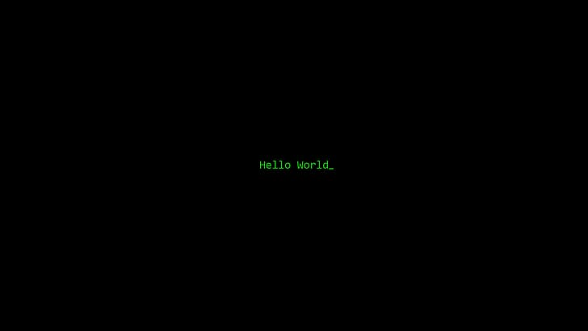

<!-- HERO -->

  
    

  <h1>Meu código está no GitLab</h1>
  
O GitHub é apenas um <b>espelho automático</b> sincronizado a cada mudança.

  <!-- CTA BUTTONS -->
  

    
    
  

  <!-- PÍLULAS -->
  

    
    
  

 

<!-- CARDS (TABLE) -->
<table align="center" width="100%">
  <tr>
    <td width="45%" valign="top">
      <h3>🔶 GitLab</h3>
      <ul>
        <li>Onde o desenvolvimento acontece</li>
        <li>Pipelines e automações</li>
        <li>Issues, Merge Requests e Releases</li>
      </ul>
      
    </td>
    <td width="10%" align="center" valign="middle">
      ➜
    </td>
    <td width="45%" valign="top">
      <h3>⚫ GitHub (Mirror)</h3>
      <ul>
        <li>Espelho sincronizado automaticamente</li>
        <li>Read-Only (sem abrir PR aqui)</li>
        <li>Serve como vitrine/backup público</li>
      </ul>
      
    </td>
  </tr>
</table>

 

<!-- MOTIVAÇÃO -->

  <h3>Por que GitLab como fonte principal?</h3>

- CI/CD integrado e poderoso  
- Melhor controle de pipelines & automações  
- Repositórios privados ilimitados  
- GitHub como **espelho** e **backup público**

 

<!-- BANNER SECUNDÁRIO -->

  

 

<!-- CONTACT / LINKS -->

  
    Para contribuir ou reportar algo, use o
    <a href="https://gitlab.com/leoribr">repositório no GitLab</a>.
  

